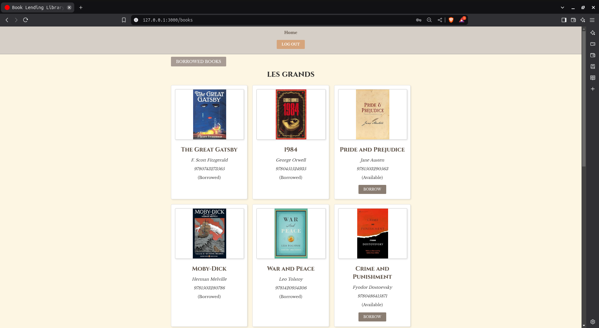
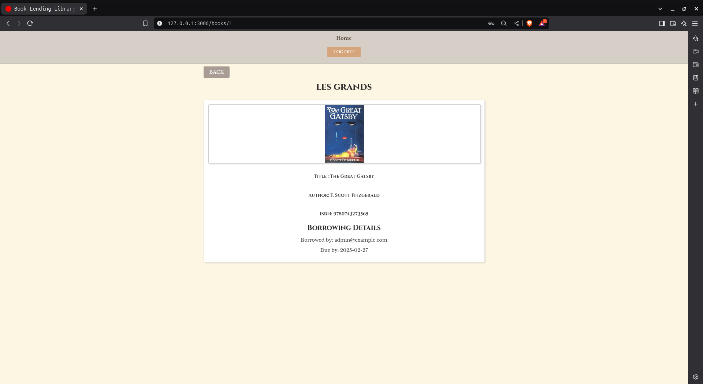
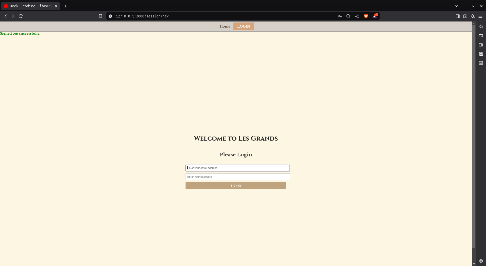
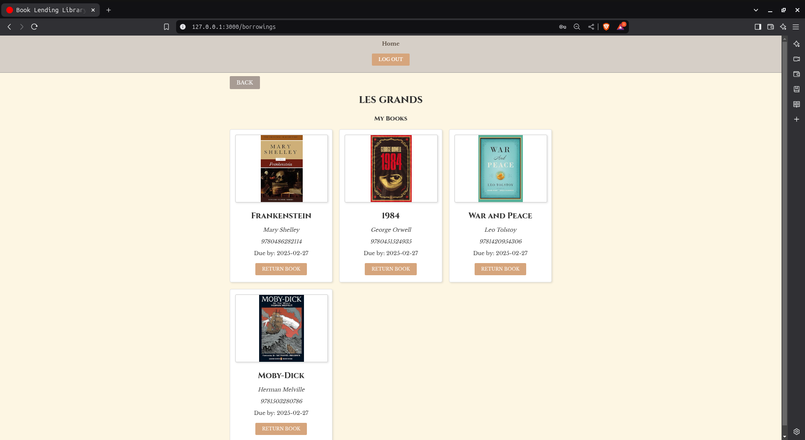

# Book Lending Library

A simple Ruby on Rails 8 application that allows registered users to browse available books, borrow a book, return a book, and view a list of books they currently have borrowed.

## Table of Contents

- [Book Lending Library](#book-lending-library)
  - [Table of Contents](#table-of-contents)
  - [Features](#features)
  - [Technologies Used](#technologies-used)
  - [Prerequisites](#prerequisites)
  - [Installation](#installation)
  - [Screenshots Demo](#screenshots-demo)

## Features

- **User Authentication:** Register and login using Rails 8's default authentication system.
- **Book Listing:** Browse a list of books with their availability status.
- **Book Details:** View details (title, author, ISBN) of a selected book and borrow it if available.
- **Borrowing System:** 
  - Create a borrowing record when a user borrows a book.
  - Each borrowing record includes a due date set to 2 weeks from the borrowing date.
  - Prevent borrowing a book that is already checked out.
- **User Profile:** View a list of books the user currently has borrowed.
- **Return Books:** Ability for users to return borrowed books.
- **Model Validations:** Ensure presence of title, author, and ISBN for each book, and enforce unique ISBNs.
- **Error Handling:** Proper error handling for cases like attempting to borrow an already borrowed book.
- **Testing:** Comprehensive tests for models using Rails' default testing framework 

## Technologies Used

- **Ruby on Rails 8**
- **Ruby**
- **SQLite3** (for development)
- **Minitest** (Rails default testing framework)
- **Bundler**

## Prerequisites

- [Ruby](https://www.ruby-lang.org/en/) (e.g., version 3.1+)
- [Rails 8](https://rubyonrails.org/)
- [Bundler](https://bundler.io/)

## Installation

1. **Clone the repository:**

   ```bash
   git clone https://github.com/your-username/book-lending-library.git
   cd book-lending-library

2. **## Install dependencies:**

    ```bash
    bundle install

3. **## Create the database:**

    ```bash
    rails db:create
    rails db:migrate
    rails db:seed
    ```

4. **## Start the server:**

   ```bash
   rails server
   ```

5. **## Access the application:**

   Open your web browser and navigate to `http://localhost:3000/` to view the application.

6. **## Run tests:**

   ```bash
   rails test
   ```

   
## Screenshots Demo






